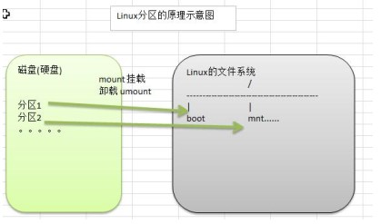
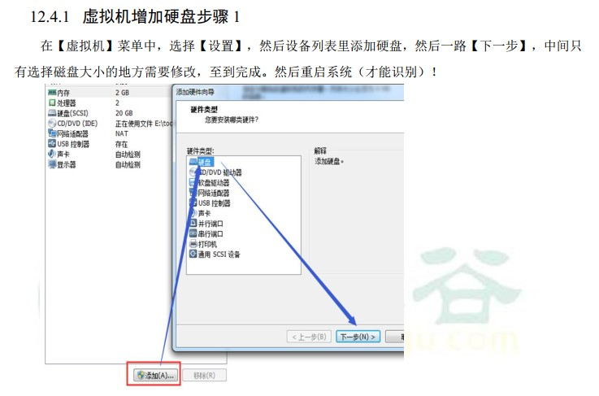

#  Linux磁盘分区、挂载度

## 1. 分区方式

* mbr分区
  * 最多支持四个主分区
  * 系统只能安装在主分区
  * 扩展分区要占一个主分区
  * MBR最大只支持2TB，但拥有最好的兼容性
* gpt分区
  * 支持无限多个主分区（但操作系统可能限制，比如windows下最多128个分区）
  * 最大支持18EB的大容量（1EB=1024PB，PB=1024TB）
  * windows7 64位以后支持gpt

## 2. Linux分区

### 2.1 分区原理

* Linux来说无论有几个分区，分给哪一个目录使用，它归根结底就只有一个根目录，一个独立且唯一的文件结构，Linux中每个分区都是用来组成整个文件系统的一部分。
* Linux采用了一种叫做“载入”的处理方法，它的整个文件系统中包含了一整套的文件和目录，且将一个分区和一个目录联系起来。这时要载入的一个分区将使它的存储空间在一个目录下获得。

**总结：所有目录中的文件都是存储再它挂载的分区上面**

### 2.2 硬盘说明

* Linux硬盘分IDE硬盘和SCSI硬盘，目前基本上是SCSI硬盘
* lsblk [-f]：查看当前系统的分区和挂载情况。（list block）

lsblk ：

lsblk -f ：

### 2.3 挂载硬盘

 **需求是给我们的Linux系统增加一个新的硬盘，并且挂载到/home/newdisk**

1. 添加硬盘
2. 分区：fdsk /dev/sdb
3. 格式化：mkfs -t ext4 /dev/sdb1
4. 挂载：新建目录：mkdir /home/newdisk；挂载：mount /dev/sdb1 /home/newdisk
5. 设置可以自动挂载（永久挂载）：重启系统后，仍然可以挂载。vim etc/fstab 增加挂载信息。mount -a：生效

#### 1) 增加硬盘

添加完成之后，`lsblk`查看硬盘分区情况：有了 新的硬盘，还没有分区

#### 2) 硬盘分区

分区命令 `fdisk 硬盘名称` 

- m 显示命令列表m

- p 显示磁盘分区 同 fdisk -l

- n 新增分区

- d 删除分区

- w 写入并退出

	

例如 对/sdb 分区：执行分区命令： `fdisk /dev/sdb` 开始分区后输入 n(新增分区)，然后选择 p(分区类型为主分区)，两次回车(默认剩余全部空间)，最后输入 w(写入分区并退出) 或者 q(不保存退出输入)。

但此时的磁盘并没有格式化：

#### 3) 格式化磁盘

格式化命令 `mkfs -t 分区类型 设备名称`

例如：`mkfs -t ext4 /dev/sdb1`

格式化之后，UUID就有了，此时还没有挂载点：

#### 4) 挂载硬盘

挂载: 将一个分区与一个目录联系起来

命令：`mount 设备名称 挂载目录`

例如: mount /dev/sdb1 /newdisk/

挂载点有了：

（此时 /newdisk 目录下的文件都会存放在 sdb硬盘中的sdb1分区中）

#### 5) 取消挂载

命令：`umount 设备名称`

例如执行：umount /dev/sdb1

#### 6) 永久挂载

**使用命令行挂载，重启后会失效**

永久挂载：通过修改 /etc/fstab 实现自动挂载

添加完成后 执行 `mount -a ` 即刻生效

执行 `vim /etc/fstab`

编辑文件，将挂载关系添加到文件中：

改好之后，再次重启，系统就会去查找这个表里面编写的挂载关系，并会执行挂载。这样就达到永久挂载效果

## 3. 磁盘状况查询

磁盘情况查询：`df -h 或 df -l`

查询指定目录的磁盘占用情况：`du -h /目录`(没有指定目录，则默认查询当前目录)

* -s：指定目录占用大小汇总
* -h：带计量单位
* -a：含文件
* -–max-depth=1：子目录深度
* -c：列出明细的同时，增加汇总值

例如：查询opt目录的磁盘使用情况，深度为1 ` du -ach --max-depth=1 /opt`

磁盘情况-工作实用指令
* 统计/home文件夹下文件的个数：`ls -l /home | grep "^-" | wc -l`
* 统计/home文件夹下目录的个数：`ls -l /home | grep "^d" | wc -l`
* 统计/home文件夹下文件的个数，包括子文件夹里的：`ls -lR /home | grep "^-" | wc -l`
* 统计文件夹下目录的个数，包括子文件夹里的：`ls -lR /home | grep "^d" | wc -l`
* 以树状显示目录结构：`tree 目录` (首先安装tree指令：`yum install tree`)

	
	