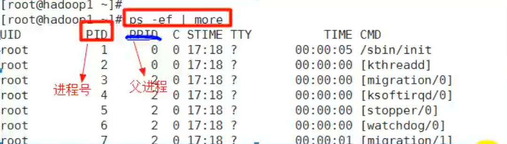

# 进程管理

## 1. 进程管理基础

* 在Linux中，每个**执行的程序（代码）**都称为一个进程。每个进程都分配一个ID号
* 每一个进程，都会对应一个父进程，而这个父进程可以复制多个子进程。
* 每个进程都可能以两种方式存在。前台和后台。
  * 前台进程：用户目前的屏幕上可以进行操作的。
  * 后台进程：实际在操作，但由于屏幕上无法看到的进程，通常使用后台方式执行。
* 一般系统的服务都是以后台进程的方式存在，而且都会常驻在系统中，直到关机才结束。

## 2. 显示系统执行的进程

### 2.1 ps指令详细介绍

`ps [选项]`：查看目前系统中，有哪些正在执行，以及它们执行的状况

* `ps -a`：显示当前终端的所有进程信息。
* `ps -u`：以用户的格式显示进程信息。
* `ps -x`：显示后台进程运行的参数。
* `ps -axu | grep xxx`：过滤得到xxx的信息。
* `ps -e`：显示所有进程。
* `ps -f`：全格式。
* `ps -ef`：以全格式显示当前所有的进程，查看进程的父进程。

**(1) `ps -axu` :显示信息选项**

**System V 展示风格**

字段|说明
---|---
USER|用户说明
PID|进程识别号
%CPU|进程占用cpu百分比
%MEM|进程占用物理内存百分比
VSZ|进程占用虚拟内存大小(KB)
RSS|进程占用物理内存大小(KB)
TTY|终端机号
STAT|进程状态，S(睡眠)，s(代表是会话的先导进程)，N(代表进程拥有比普通进程更高的优先级)，R(正在运行)，D(短期等待)，Z(僵死进程)，T(被跟踪或被停止)
STARTED|进程启动的时间
TIME|此进程所消耗的CPU时间
COMMAND|正在执行的命令或进程名
|

**(2) 显示信息解释:`ps -ef`**

**BSD 展示风格**

字段|说明
---|---
UID|用户id
PID|进程id
PPID|父进程
C|CPU用于执行优先级的因子，数值越大，表明cpu密集型运算，执行优先级会降低，数值越小，表明是I/O密集运算，执行优先级会提高
STIME|进程启动时间
TTY|终端机号
TIME|此进程所消耗的CPU时间
CMD|启动所用的命令和参数

## 3. 终止进程

若是某个进程执行一半需要停止时，或是消耗了很大的系统资源时，此时可以考虑停止该进程，使用kill命令来完成此任务

- `kill [选项] 进程号`：通过进程号杀死进程
	-9：表示强迫进程立刻停止

* `killall 进程名称`：通过进程名称杀死进程，也支持通配符，这在系统因负载过大而变得很慢时很有用

**案例1：踢掉某个非法用户登录**

此时，在 xshell中 该 登录 就会自动弹出（被踢掉了）

**案例 2: 终止远程登录服务 sshd，在适当时候再次重启 sshd 服务**

(1) `kill sshd 对应的进程号`:终止远程登录服务 sshd

此时，想要在 xshell上 远程登录 是行不通的

(2) `/bin/systemctl start sshd.service`:重启 sshd 服务

此时，想要在 xshell上 远程登录 ，又允许登录了

**案例3：终止多个gedit编辑器**

**案例4： 强制杀死一个终端**

## 4. 查看进程树

`pstree [选项]`:查看进程树

* -p：显示进程的PID
* -u：显示进程的所属用户

案例 1: 请你树状的形式显示进程的 pid

`pstree -p`

案例 2:请你树状的形式进程的用户

`pstree -u`

## 5. 服务(Service)管理

服务(Service)本质就是进程，但是是运行在后台的，通常都会监听某个端口，等待其它程序的请求，比如(mysql,sshd 防火墙等),因此我们又称为守护进程。

### 1) service管理指令

(1) service管理指令：`service 服务名 [start | stop | restart | reload | status]`

(2) 在 CentOS7.0 后 很多服务不再使用 service,而是 systemctl(后面专门讲)

(3) 目前还可以使用 service指令来管理 的服务在 /etc/init.d 查看 【绿色字体的服务】

 案例演示：请使用 service 指令 查看，关闭，启动 network【注意: 在虚拟系统演示，因为网络连接会关闭】

- 查看：`service network status`
- 关闭：`service network stop`
- 启动：`service network start`

### 2) 服务查看方式

**方式1:** 使用 setup -> 系统服务 就可以看到全部

`setup`

选中 系统服务 回车 :

按 tab 选择 确定/取消 ；

**方式2:** /etc/init.d 看到 service 指令管理的服务

`ls -l /etc/init.d` (CentOS7版本的服务查看方式：`systemctl list-unit-files`)

### 3) 服务的运行级别（runlevel）

查看或修改默认级别：vim /etc/inittab

每个服务对应的每个运行级别都可以设置

Linux 系统有 7 种运行级别(runlevel): 常用的是级别3 和5

- 运行级别 0: 系统停机状态，系统默认运行级别不能设为 0，否则不能正常启动
- 运行级别 1: 单用户工作状态，root 权限，用于系统维护，禁止远程登陆
- 运行级别 2: 多用户状态(没有 NFS)，不支持网络
- 运行级别 3: 完全的多用户状态(有 NFS)，无界面，登陆后进入控制台命令行模式
- 运行级别 4: 系统未使用，保留
- 运行级别 5: X11 控制台，登陆后进入图形 GUI 模式
- 运行级别 6: 系统正常关闭并重启，默认运行级别不能设为 6，否则不能正常启动

### 4) 开机流程

### 5) CentOS7 后运行级别说明

在 /etc/initab 进行了简化 ，如下

- multi-user.target: analogous to runlevel 3  【运行级别3】

- graphical.target: analogous to runlevel 5   【运行级别5】

查看当前默认的运行级别:`systemctl get-default`

设置当前默认运行级别 :`systemctl set-default 运行级别` 

比如设置当前默认运行级别为3：`systemctl set-default multi-user.target`

### 6) chkconfig指令

通过 chkconfig 命令可以给服务的各个运行级别设置自 启动/关闭

chkconfig 指令管理的服务在 /etc/init.d 查看

注意: Centos7.0 后，很多服务使用 systemctl 管理(后面马上讲)

**基本语法**

* 查看xxx服务：`chkconfig –-list [| grep xxx]`
* 查看指定服务的状态：`chkconfig 服务名 --list`
* 给指定服务的运行级别设置自启动：`chkconfig -–level 5 服务名 on/off`
* 给指定服务的所有运行级别关闭或开启：`chkconfig 服务名 on/off`
* **chkconfig重新设置后需要重新启动才能生效**

**案例演示**

对 network 服务 进行各种操作

把 network 在 3运行级别,关闭自启动：`chkconfig --level 3 network off`
把 network 在 3运行级别,开启自启动：`chkconfig --level 3 network on`

**使用细节**

chkconfig 重新设置服务后自启动或关闭，需要重启机器 reboot 生效

### 7) systemctl 管理指令

**基本语法:**

- 开启服务：`systemctl start 服务名`

- 停止服务：`systemctl stop 服务名`

- 重启服务：`systemctl restart 服务名`

- 查询服务：`systemctl status 服务名`

	

systemctl 指令管理的服务在 `/usr/lib/systemd/system` 查看

**设置服务的自启动状态:**

查看服务开机启动状态（grep 可以进行过滤）：`systemctl list-unit-files [ |grep 服务名 ]`

查询某个服务是否是自启动的：`systemctl is-enabled 服务名`

设置服务开机自启动：`systemctl enable 服务名`

关闭服务开机自启动：`systemctl disable 服务名` 

**应用案例**

- 查看防火墙的服务名称：`/usr/lib/systemd/system | grep fire `

	

- 关闭防火墙：`systemctl stop firewalld`

- 重启防火墙：`systemctl restart firewalld` 

- 查看防火墙的开机启动状态：`systemctl list-unit-files |grep firewalld`

	

- 关闭防火墙的开启自启动：`systemctl disable firewalld`

**细节讨论**

- 关闭或者启用防火墙后，立即生效。[telnet 测试 某个端口即可]

	`systemctl [start| stop] firewalld`

	这种方式只是临时生效，当重启系统后，还是回归以前对服务的设置。

- 如果希望设置某个服务自启动或关闭**永久生效**，要设置 关闭或者开启 开机自启动

	`systemctl [enable | disable] 服务名`

	

### 9) 打开或者关闭指定端口

在真正的生产环境，往往需要将防火墙打开，但问题来了，如果我们把防火墙打开，那么外部请求数据包就不能跟服务器监听端口通讯。这时，需要打开指定的端口。比如 80、22、8080 等，这个又怎么做呢? [示意图]

### 10) firewall 指令

(1) 打开端口: `firewall-cmd --permanent --add-port-端口号/协议`

(2) 关闭端口: `firewall-cmd --permanent --remove-port-端口号/协议`

(3) 重新载入,才能生效 : `firewall-cmd --reload`

(4) 查询端口是否开放: `firewall-cmd --query-port=端口/协议`

**应用案例**

(1) 启用防火墙，在cmd窗口 测试 111 端口是否能 telnet 【目前不行】

(2) 开放 111 端口

​	打开端口：`firewall-cmd --permanent --add-port=111/tcp` 

​	重新载入：`frewall-cmd --reload`

(3) 再次关闭 111 端口

​	关闭端口：`firewall-cmd --permanent --remove-port=111/tcp` 

​	重新载入：`frewall-cmd --reload`

## 6. 动态监控进程

top与ps命令很相似，都是用来显示正在执行的进程，top的不同之处在于**top执行一段时间可以更新正在运行的进程**

### 1) 基本语法

**top [选项]**

- -d 秒数：指定top命令每隔几秒更新。默认是3秒。
- -i：使top不显示任何闲置或者僵死进程。
- -p：通过指定监控进程ID来仅仅监控某个进程的状态。

**交互操作说明：**

操作|功能
---|---
P|以CPU使用率排序，默认就是此项
M|以内存的使用率排序
N|以PID排序
q|退出top
|

**动态进程监控图例**

### 2) 应用案例

**案例 1.监视特定用户，比如我们监控 tom 用户**

top: 输入此命令，按回车键，查看执行的进程

u: 然后输入“u”回车，再输入用户名，即可

**案例 2: 终止指定的进程，比如我们要结束 tom 登录**

top: 输入此命令，按回车键，查看执行的进程

k: 然后输入“k”回车，再输入要结束的进程ID号

**案例 3:指定系统状态更新的时间(每隔 10 秒自动更新)，默认是 3 秒**

top -d 10

## 7. 监控网络状态

### 1) 查看网络情况

**基本语法:`netstat [选项]`**

- -an：按一定顺序排列输出
- -p：显示哪个进程在调用

**应用案例**

1) 查看所有的网络服务

* netstat -anp | more

	

	图解一下，上图中的链接

	

2) 查看sshd的服务的信息

* netstat -anp | grep sshd

### 2) 检测主机连接命令 ping

是一种网络检测工具，它主要是用检测远程主机是否正常，或是两部主机间的网线或网卡故障。

如: ping 对方 ip 地址