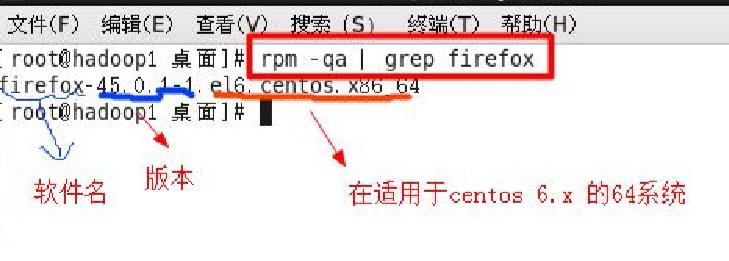

# 包管理工具

## 1. RPM包

### 1) 介绍

rpm 用于互联网下载包的打包及安装工具，它包含在某些 Linx 分发版中。它生成具有RPM 扩展名的文件。RPM是 RedHat Package Manager (RedHat 软件包管理工具)的缩写，类似windows 的 setup.exe, 这一文件格式名称虽然打上了 RedHat 的标志，但理念是通用的。

Linux 的分发版本都有采用 (suse,redhat,centos 等等)，可以算是公认的行业标准了。

### 2) rpm 包的简单查询指令

RPM查询已安装的rpm列表：`rpm -qa | grep xx`

例如 查看是否安装firefox：`rpm -qa |grep firefox`

### 3) rpm 包名基本格式

一个 rpm 包名：firefox-60.2.2-1.el7.centos.x86_64

- 名称：firefox
- 版本号：60.2.2-1
- 适用操作系统: el7.centos.x86_64
	- 表示 centos7.x 的 64 位系统
	- 如果是 i686、i386 表示 32 位系统，noarch 表示通用

### 4) rpm 包的其它查询指令

* `rpm -qa`：查询所安装的所有rpm软件包
* `rpm -qa | more`
* ``rpm -qa | grep X[rpm -qa|grep firefox]`
* `rpm -q 软件包名`：查询xx软件包是否安装
* `rpm -qi 软件包名`：查询软件包信息
* `rpm -ql 软件包名`：查询软件包中的文件
* `rpm -qf 文件全路径名`：查询文件所属的软件包

### 5) 卸载rpm包

**基本语法**：`rpm -e 软件包名称`

**应用案例**

删除 firefox 软件包：`rpm -e firefox`

**细节讨论**

(1) 如果其它软件包依赖于您要卸载的软件包，卸载时则会产生错误信息。

​	如执行: ` $ rpm -e foo`

​	会提示：removing these packages would break dependencies:foo is needed by bar-1.0-1

(2) 如果我们就是要删除 foo 这个 rpm 包，可以增加参数 `--nodeps`，就可以强制删除，但是一般不推荐这样做，因为依

​	赖于该软件包的程序可能无法运行

​	如执行: `$ rpm -e --nodeps foo`

### 6) 安装rmp包

**基本语法**：`rpm -ivh RPM 包全路径名称`

**参数说明**

- i（install 安装）

- v（verbose 提示）

- h（hash 进度条）

	

**应用实例**：演示卸载和安装 firefox 浏览器

- rpm -e firefox
- rpm -ivh firefox

## 2. YUM

### 1) 介绍

Yum 是一个 Shell 前端软件包管理器。基于 RPM 包管理，能够从指定的服务器自动下载 RPM 包并且安装，可以自动处理依赖性关系，并且一次安装所有依赖的软件包

示意图

### 2) yum 的基本指令

查询 yum 服务器是否有需要安装的软件：`yum list grep xx 软件列表`

### 3) 安装指定的 yum 包

yum install xxx 

### 4) yum 应用实例

案例:请使用 yum 的方式来安装 firefox

- `rpm -e firefox`：
- `yum list | grep firefox`：查询yum服务器是否有firefox软件
- `yum install firefox`：安装firefox软件的yum包

* `yum -y remove firefox`：卸载firefox软件的yum包
